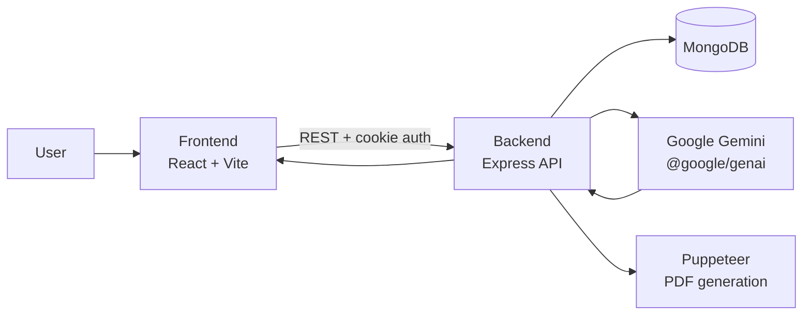

# Interview AI

## Overview

Interview AI is a full-stack generative AI application that helps users prepare for job interviews by analyzing a job description together with either a resume PDF or a short self-description. The backend uses Google Gemini to generate a structured interview strategy, identify skill gaps, propose technical and behavioral questions, and create a tailored preparation roadmap. It can also generate a resume-style PDF optimized for the target role.

The project is split into a Node.js/Express backend and a React/Vite frontend. Authentication is handled through JWTs stored in cookies, and user data plus generated interview reports are stored in MongoDB.

## Features

- User registration, login, logout, and session hydration
- Cookie-based JWT authentication with token blacklisting on logout
- Protected pages for authenticated users only
- AI-generated interview report from a job description plus either:
  - an uploaded resume PDF, or
  - a short self-description
- Structured output including match score, technical questions, behavioral questions, skill gaps, and a preparation plan
- History of generated interview reports
- AI-generated resume HTML converted into downloadable PDF
- Modern React UI with separate Home and Interview views

## Tech Stack

### Frontend

- React 19
- React Router 7
- Vite
- Axios
- Sass

### Backend

- Node.js
- Express 5
- MongoDB with Mongoose
- bcrypt / bcryptjs
- jsonwebtoken
- cookie-parser
- cors
- multer
- pdf-parse
- Puppeteer
- Google Gen AI SDK (`@google/genai`)
- Zod and `zod-to-json-schema`

## Architecture

The application uses a simple client-server architecture:



### Backend Layers

- `server.js` boots the application, loads environment variables, connects to MongoDB, and starts the server on port `3000`.
- `src/app.js` configures Express middleware and registers the API routes.
- `src/routes/` defines auth and interview endpoints.
- `src/controllers/` contains the request handlers.
- `src/middlewares/` contains authentication and file upload middleware.
- `src/models/` defines MongoDB schemas for users, interview reports, and blacklisted tokens.
- `src/services/ai.service.js` encapsulates Gemini prompt execution and PDF generation.

### Frontend Layers

- `src/features/auth/` manages authentication state, login, register, and protected route handling.
- `src/features/interview/` manages interview report generation, report history, and report detail pages.
- React Context is used for local application state instead of a global store.

## Folder Structure

```text
.
├── .gitignore
├── README.md
├── Backend
│   ├── .env
│   ├── package-lock.json
│   ├── package.json
│   ├── server.js
│   └── src
│       ├── app.js
│       ├── config
│       │   └── database.js
│       ├── controllers
│       │   ├── auth.controller.js
│       │   └── interview.controller.js
│       ├── middlewares
│       │   ├── auth.middleware.js
│       │   └── file.middleware.js
│       ├── models
│       │   ├── blacklist.model.js
│       │   ├── interviewReport.model.js
│       │   └── user.model.js
│       ├── routes
│       │   ├── auth.routes.js
│       │   └── interview.routes.js
│       └── services
│           └── ai.service.js
└── Frontend
    ├── eslint.config.js
    ├── index.html
    ├── package-lock.json
    ├── package.json
    ├── public
    │   ├── favicon.svg
    │   └── icons.svg
    ├── src
    │   ├── App.jsx
    │   ├── app.routes.jsx
    │   ├── main.jsx
    │   ├── style.scss
    │   ├── style
    │   │   └── button.scss
    │   └── features
    │       ├── auth
    │       │   ├── auth.context.jsx
    │       │   ├── auth.form.scss
    │       │   ├── components
    │       │   │   └── Protected.jsx
    │       │   ├── hooks
    │       │   │   └── useAuth.js
    │       │   ├── pages
    │       │   │   ├── Login.jsx
    │       │   │   └── Register.jsx
    │       │   └── services
    │       │       └── auth.api.js
    │       └── interview
    │           ├── interview.context.jsx
    │           ├── hooks
    │           │   └── useInterview.js
    │           ├── pages
    │           │   ├── Home.jsx
    │           │   └── Interview.jsx
    │           ├── services
    │           │   └── interview.api.js
    │           └── style
    │               ├── home.scss
    │               └── interview.scss
    └── vite.config.js
```

## Installation

### Prerequisites

- Node.js 18+ recommended
- MongoDB database or MongoDB Atlas connection string
- Google Gemini API key

### Backend Setup

```bash
cd Backend
npm install
```

### Frontend Setup

```bash
cd Frontend
npm install
```

## Environment Variables

### Backend

Create a `Backend/.env` file with the following variables:

- `MONGO_URI`
- `JWT_SECRET`
- `GOOGLE_GENAI_API_KEY`

### Frontend

- Not found in project.

## Running the Project

### Start the Backend

```bash
cd Backend
node server.js
```

The backend runs on `http://localhost:3000`.

### Start the Frontend

```bash
cd Frontend
npm run dev
```

The frontend runs on `http://localhost:5173`.

## How It Works

1. A user registers or logs in through the frontend.
2. The backend hashes passwords with bcrypt, signs a JWT, and stores it in a cookie named `token`.
3. The protected frontend routes call `GET /api/auth/get-me` to restore the current session.
4. On the Home page, the user submits a job description and either:
   - uploads a resume file, or
   - enters a self-description.
5. The frontend sends the data to `POST /api/interview/` as `multipart/form-data`.
6. The backend verifies the cookie JWT, parses the resume PDF if present, and sends the combined input to Gemini.
7. Gemini returns a structured JSON interview report. The backend validates and saves it in MongoDB.
8. The frontend redirects to `/interview/:interviewId` to display the generated report.
9. The user can browse past reports or request a resume PDF from `POST /api/interview/resume/pdf/:interviewReportId`.

## API Documentation (if applicable)

### Authentication

#### `POST /api/auth/register`

Registers a new user.

Request body:

```json
{
  "username": "Jane Doe",
  "email": "jane@example.com",
  "password": "secret-password"
}
```

#### `POST /api/auth/login`

Logs in an existing user.

Request body:

```json
{
  "email": "jane@example.com",
  "password": "secret-password"
}
```

#### `GET /api/auth/logout`

Clears the auth cookie and blacklists the active token.

#### `GET /api/auth/get-me`

Returns the currently authenticated user.

### Interview Reports

#### `POST /api/interview/`

Generates a new interview report.

Content type: `multipart/form-data`

Form fields:

- `jobDescription` - required
- `selfDescription` - optional if a resume is uploaded
- `resume` - optional file upload handled by `multer`

#### `GET /api/interview/`

Returns all interview reports for the logged-in user.

#### `GET /api/interview/report/:interviewId`

Returns a single interview report owned by the logged-in user.

#### `POST /api/interview/resume/pdf/:interviewReportId`

Generates and downloads a PDF resume for the selected interview report.

Response type: `application/pdf`

## AI Components

### LLM Provider

- Google Gemini via `@google/genai`

### Models Used

- `gemini-3-flash` for interview report generation
- `gemini-3-flash-preview` for resume HTML generation

### Prompt Engineering Strategy

The prompts are built as inline template strings inside `Backend/src/services/ai.service.js`. They combine:

- resume text extracted from a PDF, if available
- a self-description fallback, if provided
- the target job description

The report-generation prompt asks Gemini to return a JSON object with:

- `matchScore`
- `technicalQuestions`
- `behavioralQuestions`
- `skillGaps`
- `preparationPlan`
- `title`

The resume-generation prompt asks Gemini to return a JSON object with a single `html` field containing ATS-friendly resume markup.

### Prompt Templates

Not stored as external template files. The prompt templates are embedded directly in `Backend/src/services/ai.service.js`.

### Response Processing

- Gemini responses are configured to use `application/json` output.
- `zod` defines the expected output shape.
- `zod-to-json-schema` converts the schema for Gemini response validation.
- Returned JSON is parsed with `JSON.parse(response.text)`.
- Resume HTML is rendered to PDF with Puppeteer.

### Embeddings, Vector Database, and RAG

- Embedding model: Not found in project.
- Vector database: Not found in project.
- Retrieval-Augmented Generation (RAG): Not found in project.
- Conversation memory: Not found in project.

### Streaming Responses

- Not found in project.

### Error Handling and Fallbacks

- Controllers use `try/catch` blocks and return generic 500 responses on failure.
- No retry policy or model fallback is implemented.
- No circuit breaker or queueing layer is present.

### Rate Limiting

- Not found in project.

### Model Configuration

- Response MIME type is set to `application/json`.
- Structured response schemas are enforced through Zod-derived JSON Schema.
- No temperature, top-p, or top-k tuning is explicitly configured in the code.

## Project Workflow

1. User enters the application through the frontend.
2. Auth context checks whether a valid session exists.
3. If unauthenticated, the user is redirected to `/login` or `/register`.
4. After authentication, the user lands on the Home page and submits a job description plus resume or self-description.
5. The frontend sends a multipart request to the backend interview endpoint.
6. The backend validates the request, extracts resume text when possible, and calls Gemini.
7. Gemini returns the interview strategy JSON, which is stored in MongoDB.
8. The frontend opens the generated report page and renders:
   - technical questions
   - behavioral questions
   - skill gaps
   - the preparation roadmap
9. The user can also download a resume PDF generated from the saved report data.

## Future Enhancements

- Add streaming AI responses for faster perceived performance
- Add retries and model fallback handling for Gemini failures
- Add rate limiting and abuse protection on public auth endpoints
- Add frontend and backend validation feedback for better UX
- Add support for parsing DOC/DOCX resumes, since the UI currently accepts them but the backend resume parser is PDF-oriented
- Add file type and size messaging consistency between frontend and backend
- Add automated tests for controllers, hooks, and major user flows
- Externalize prompt templates into separate files for easier iteration
- Add richer error states in the frontend instead of silent catch blocks

## Contributors

- Bhasvati Sristi

## License

ISC, as declared in `Backend/package.json`.

No standalone `LICENSE` file was found in the project.
